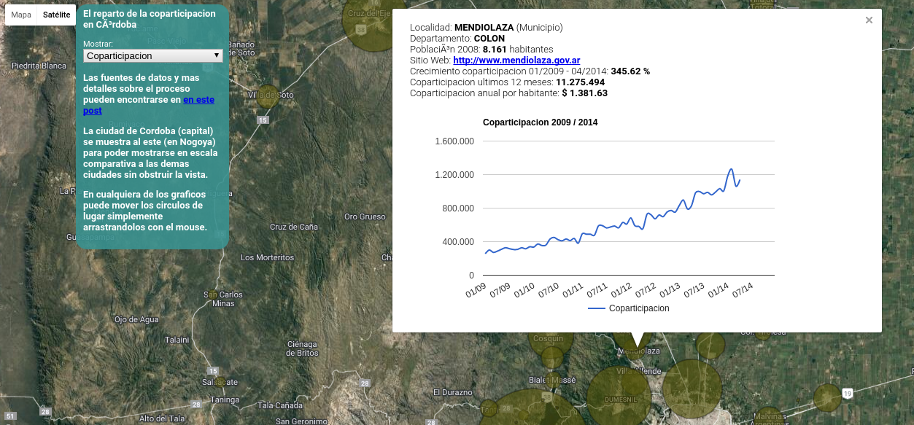

## Coparticipación a Municipios en Córdoba

Disponible online [aquí](https://avdata99.github.io/coparticipacion-a-municipios-en-la-provincia-de-cordoba/).  

[PDF de la Provincia](http://www.cba.gov.ar/coparticipacion/) pasados a CSV para analizarse.

Comenzado en 2014 en [este post](https://andresvazquez.com.ar/blog/la-coparticipacion-provincial-de-recursos-en-cordoba/).  

En la carpeta [resources/cba](resources/cba) están los PDFs y los CSV procesados con Tabula.  
